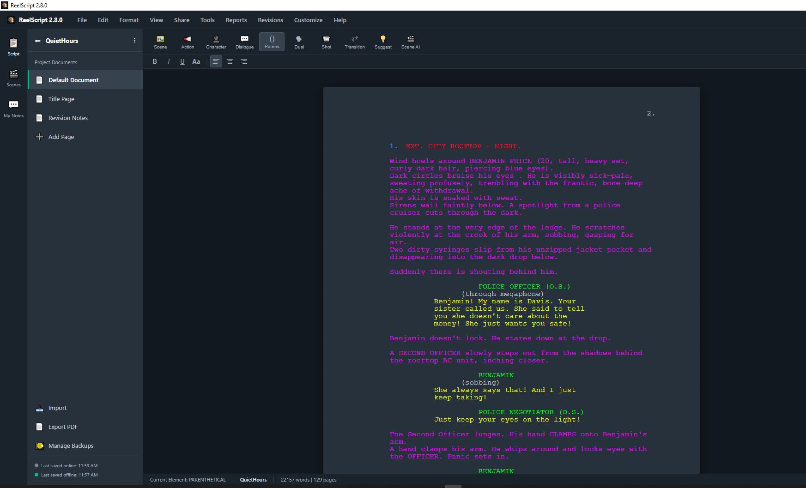

# 🎬 ReelScript

**ReelScript** is a professional screenplay writing application built for Windows. It combines industry-standard formatting with real-time collaboration, AI-assisted writing, and an aggressive backup system — everything a screenwriter needs in one place.

> **Current Version:** 4.2.6 &nbsp;|&nbsp; **Last Updated:** June 4, 2026



---

## ✨ Features

### 📝 Smart Screenplay Editor
- Auto-formats as you type using standard screenplay conventions (Scene Heading → Action → Character → Dialogue)
- `Tab` and `Enter` intelligently jump between element types so you never break your flow
- **Dual Dialogue** support (`Ctrl+D`)
- Full **Find & Replace** (`Ctrl+F`) with Match Case support
- **Focus Mode** (`F11`) — hides all UI so you can just write
- **Dark Mode** for late-night sessions
- **Line Numbers** (`View -> Line Numbers`) — internal togglable reference that doesn't export to PDF
- **Format Menu** — fully functional dropdown to manually assign or switch formats on the fly

### 🤝 Collaboration & Revision Tracking
- Built-in **Revision Tracker** tags every edit with a color-coded asterisk linked to the author's profile
- Hover over any asterisk to see who made the change
- **Revision Notes** — right-click an asterisk to leave an explanation for your collaborator
- One-click **Approve** to accept changes and clean up the script
- Shareable `.rsp` (ReelScript Project) file format for easy back-and-forth

### 🤖 AI Assistant (Powered by Google Gemini - BYOK)
| Feature | How to Use |
|---|---|
| **Suggest** — brainstorm rewrites & ideas | Highlight text → click 💡 Suggest |
| **AI Auto-Fix** — grammar & flow suggestions | Highlight text → Right-click → ✨ AI Auto-Fix |
| **Scene Analysis** — pacing, dialogue & format feedback | Right-click a scene → 🎬 AI Check Scene |
| **Full Script Analysis** — comprehensive developmental edit | Reports → 🤖 AI Script Analysis |
| **LIMITATIONS** — it will not write for you, only offer ways to improve |

> Line numbers in AI reports are **clickable** — click `Line#45` and the editor jumps straight there.

### 💾 Backups & Auto-Save
- Auto-saves every **1 second** of typing pause + configurable timed interval (default: 5 min)
- **Local backup folder** (default: `Documents/ReelScript`)
- **Cloud backup folder** — point it at Google Drive or Dropbox for off-site copies
- Rolling backup limit (default: 5) automatically prunes the oldest files
- **Manual Snapshots** — name a save state before a major rewrite and restore it anytime

### 🛠️ Tools
- **Mind Map** (`View -> Mind Map`) — visualize scene flows with auto-populated metadata cards
- **Auto-Format Correction Logs** (`Help -> Correction Logs`) — tracks and logs formatting fixes by Scene # and Line #
- **Custom Filters** (`Tools -> Filters -> Custom Filter`) — selectively isolate ANY combination of line types (e.g. only Action and Shots)
- **Character Filter** — isolate one character's dialogue to read their arc in sequence. Now features persistent sortable list order (Asc/Desc).
- **Capitalize Names** (`Tools -> Char -> Capitalize Names`) — Checklist tool to capitalize character names outside of dialogue safely.
- **Text Color Highlight Tool** — Quickly highlight text with your custom script format colors or any custom hex color directly from the mini toolbar.
- **Rename Character** — globally rename across headers, dialogue, and action lines
- **Spellcheck** — custom dictionary that ignores screenplay abbreviations (`INT/EXT`) and supports custom names
- **Export to PDF** — industry-standard formatting with Title Page
- **Export to Final Draft (.fdx)** — native format for producers and agents

### 🔄 Automatic Updates
- Checks [GitHub](https://github.com/XENOHEAD/reelscript/releases) for new versions silently on every launch
- A **⚡ UPDATE NOW** banner appears in the title bar when an update is available
- **Customize → Check for Updates...** to check manually at any time
- No telemetry — the only network call is a single read of `version.json` from GitHub

---

## ⚡ Keyboard Shortcuts

| Shortcut | Action |
|---|---|
| `Ctrl+1` | Scene Heading |
| `Ctrl+2` | Action |
| `Ctrl+3` | Character |
| `Ctrl+4` | Parenthetical |
| `Ctrl+5` | Dialogue |
| `Ctrl+6` | Transition |
| `Ctrl+7` | Shot |
| `Ctrl+Enter` | Hard Page Break |
| `Ctrl+D` | Dual Dialogue |
| `Ctrl+F` | Find & Replace |
| `Ctrl+Z / Y` | Undo / Redo |
| `Ctrl+B / I / U` | Bold / Italic / Underline |
| `Ctrl+K` | Drop a pin |
| `Ctrl+J` | Jump to dropped pin |
| `Ctrl+G` | Go to page or scene number |
| `Ctrl+Shift+D` | Start / Stop dictation |
| `Ctrl+Shift+F` | Toggle full-screen |
| `Ctrl+Shift+S` | Manage Backups & Auto-Save |
| `Ctrl+] / [` | Add / Remove revision mark |
| `Alt+Arrow Up/Down` | Move selection up / down one line |
| `F11` | Toggle Focus Mode |

---

## 🚀 Installation

> **Requires Windows 10 or later**

### For End Users

1. Download **`ReelScript_Setup.exe`** from [GitHub Releases](https://github.com/XENOHEAD/reelscript/releases).
2. Double-click it and follow the install wizard.
3. A **ReelScript** shortcut will appear on your Desktop and in the Start Menu.
4. `.rsp` project files are automatically associated with the app.

The installer handles everything — no command line, no admin batch files.

### For Developers (Building from Source)

1. Install [Python 3.11+](https://www.python.org/downloads/) and [Inno Setup 6](https://jrsoftware.org/isdl.php).
2. Clone the repo and run:
   ```bat
   build.bat
   ```
3. This produces:
   - `dist\ReelScript.exe` — standalone executable
   - `dist\ReelScript_Setup.exe` — full Windows installer

### First-Time Setup

Before writing, set your author profile so your revisions are properly attributed:

1. Open ReelScript.
2. Go to **Customize → Author Profile & Revision Color**.
3. Enter your name and pick a color.
4. Click **Save Profile**.

---

## 🧱 Tech Stack

| Layer | Technology |
|---|---|
| Editor UI | HTML / CSS / JavaScript (`index.html`, `script.js`) |
| Desktop Shell | Python + [pywebview](https://pywebview.flowrl.com/) |
| AI | [Google Gemini](https://ai.google.dev/) via `google-genai` |
| PDF Export | `fpdf2` |
| Spell Check | `pyspellchecker` |
| Build | PyInstaller + [Inno Setup 6](https://jrsoftware.org/isdl.php) |

---

## 🗂️ Project Structure

```
reelscript/
├── index.html              # Main editor UI
├── script.js               # All editor logic
├── styles.css              # Styling
├── reelscript.pyw          # Python desktop shell (pywebview)
├── developer_hub.pyw       # Developer tools
├── installer.iss           # Inno Setup installer script
├── build.bat               # One-click build + package script
├── requirements.txt        # Python dependencies
├── version.json            # Version & changelog
├── ReelScript_Manual.txt   # Plain text user manual
├── manual.html             # Fancy HTML user manual
└── FEATURE FILM SCREENPLAY FORMAT.docx  # Format reference
```

---

## 📖 Documentation

For full usage details, see the [Fancy HTML Manual](./manual.html) or the [Plain Text Manual](./ReelScript_Manual.txt).

---

## 📄 License

See [LICENSE](./LICENSE) for details.
